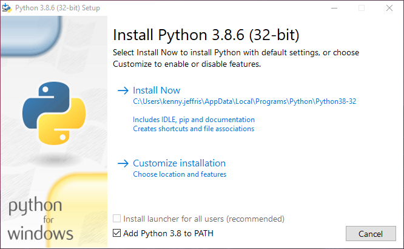
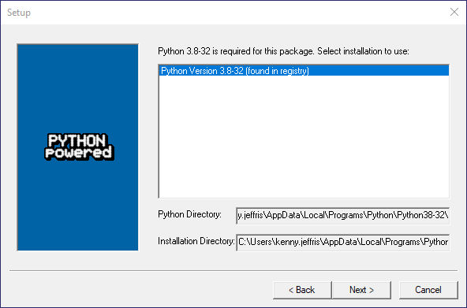

# ThermalWashFixture
This contains labview code for production Thermal Wash Fixture

# Python Setup
## Dependencies
Python 3.8.6 32-bit (x86) [[Download](https://www.python.org/ftp/python/3.8.6/python-3.8.6.exe)] [[Repository](https://www.python.org/downloads/windows/)]

Pyscard (Environment: PYTHON=C:\Python38, PYTHON_VERSION=3.8.x, PYTHON_ARCH=32) [[Repository](https://ci.appveyor.com/project/LudovicRousseau/pyscard)]

Installers should be saved in Python/Dependencies

Install Python first, and make sure to select ***Add Python X.X to PATH***

When installing pyscard, make sure the python installation matches the target version.

## Requirements
Once python and pyscard are installed, open a command prompt, powershell, or bash shell and change directory to Python within the source folder 

`cd path/to/source/Python` 

Install the remaining python requirements 

`pip install -r requirements.txt`